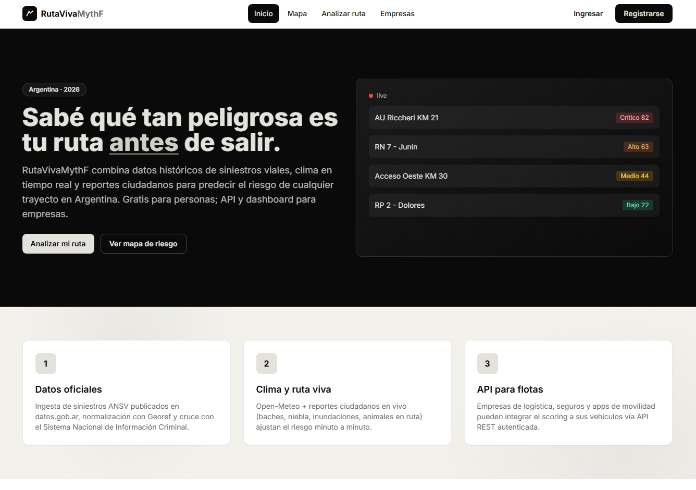
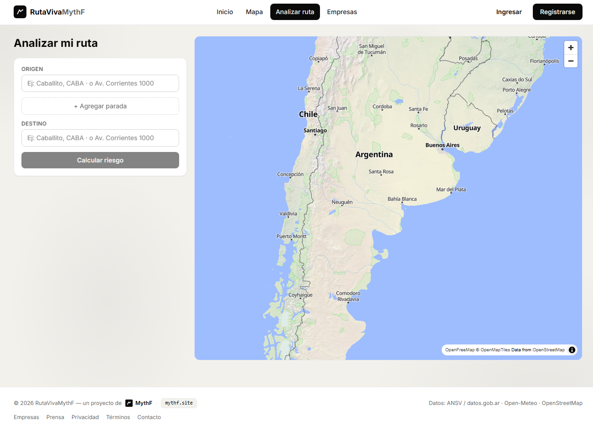
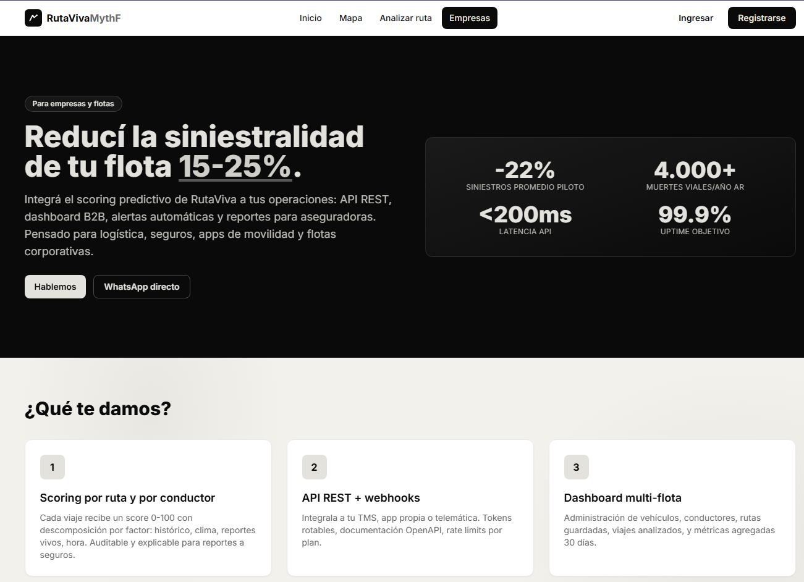

# RutaVivaMythF — Showcase

Predicción de riesgo vial en Argentina con datos oficiales, clima en tiempo real y modelo XGBoost.

Stack: React 19 + TypeScript + PWA / Python FastAPI + MySQL / Docker. 31 tests.

> Repo de muestra para portfolio. Sin credenciales, sin datos de producción.
> El proyecto completo y demo en vivo se comparten en entrevista.

## Capturas





## Estructura
- `backend/` FastAPI + SQLAlchemy + risk engine híbrido (heurístico + XGBoost opcional)
- `frontend/` React + TypeScript + Vite + MapLibre + PWA

## Correr en local
```bash
# DB dev
docker compose up -d
# Backend
cd backend && cp .env.example .env && pip install -r requirements.txt && python seed.py && uvicorn app.main:app --reload
# Frontend
cd frontend && npm install && npm run dev
```
